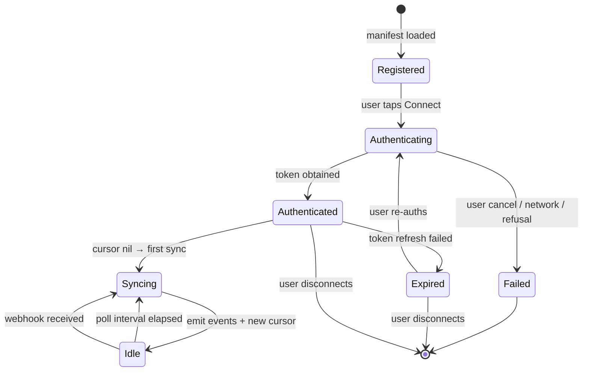

# Connector framework

The connector runtime is the moat. Each connector is a self-contained crate that implements a narrow, stable trait surface, ships a manifest, and emits events into the core.

## Trait surface

```rust
// crates/focus-connectors/src/lib.rs (sketch)

#[async_trait]
pub trait Connector: Send + Sync {
    /// Stable identifier: "canvas", "google-calendar", etc.
    fn id(&self) -> &'static str;

    /// Declarative manifest (parsed from connector's manifest.json).
    fn manifest(&self) -> &ConnectorManifest;

    /// Begin or refresh authentication. Returns a handle the runtime stores.
    async fn authenticate(&self, ctx: &AuthContext) -> Result<AuthHandle, ConnectorError>;

    /// Poll or stream events since `cursor`. Returns new events + updated cursor.
    async fn sync(
        &self,
        ctx: &SyncContext,
        cursor: Option<Cursor>,
    ) -> Result<SyncResult, ConnectorError>;

    /// Optional webhook receiver. Default: unsupported.
    async fn handle_webhook(&self, _payload: WebhookPayload) -> Result<Vec<Event>, ConnectorError> {
        Err(ConnectorError::Unsupported)
    }
}
```

## Manifest

Every connector ships `manifest.json` alongside its Cargo manifest. Schema lives under [`connector-sdk/manifest`](/connector-sdk/manifest).

```json
{
  "id": "canvas",
  "name": "Canvas LMS",
  "version": "0.1.0",
  "category": "lms",
  "verification_tier": "phenotype-verified",
  "auth": {
    "kind": "oauth2-code-pkce",
    "authorize_url": "https://<instance>.instructure.com/login/oauth2/auth",
    "token_url": "https://<instance>.instructure.com/login/oauth2/token",
    "scopes": ["url:GET|/api/v1/courses", "url:GET|/api/v1/assignments"]
  },
  "events": [
    {
      "type": "assignment.upcoming",
      "schema_ref": "#/definitions/AssignmentUpcoming"
    },
    {
      "type": "assignment.submitted",
      "schema_ref": "#/definitions/AssignmentSubmitted"
    }
  ],
  "rate_limits": {
    "requests_per_minute": 60,
    "strategy": "exponential-backoff"
  },
  "poll_interval_seconds": 300
}
```

## Lifecycle



## Error surface

Connector errors are **loud**. The runtime surfaces each to the UI as:

| `ConnectorError` | UI message (example) |
|-----------------|---------------------|
| `AuthExpired` | "Canvas token expired. Reconnect to resume rules that use it." |
| `RateLimited { retry_after }` | "Canvas rate-limited us. Retrying in 2m 14s." |
| `SchoolSpecific { base_url, status }` | "Your Canvas instance returned HTTP 403. Check your school's Canvas support." |
| `Transient` | "Couldn't reach Canvas. Retrying..." (with exponential backoff) |
| `Unsupported` | "This connector doesn't support webhooks yet." |

There is no silent skip. If a connector fails repeatedly, its emitted events never arrive, rules stop firing — and the UI says so. See [ADR](/architecture/adrs) on the fail-loudly principle.

## Promotion path

Phenotype-org cross-project reuse: once two or more repositories need the connector runtime, the runtime crate (`focus-connectors`) graduates to a shared crate in `phenotype-shared`. Existing connectors become external crates that depend on the shared runtime.

See [Cross-Project Reuse Protocol](https://github.com/KooshaPari/FocalPoint/blob/main/CLAUDE.md).
