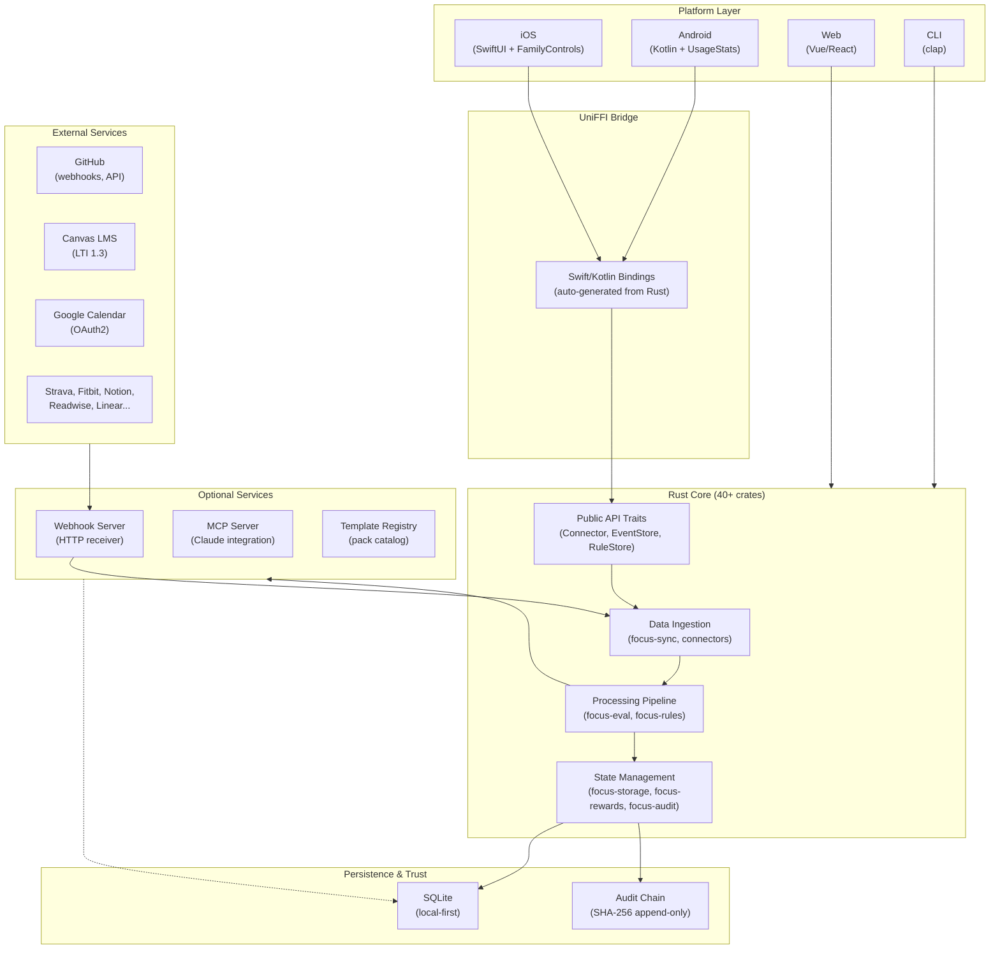
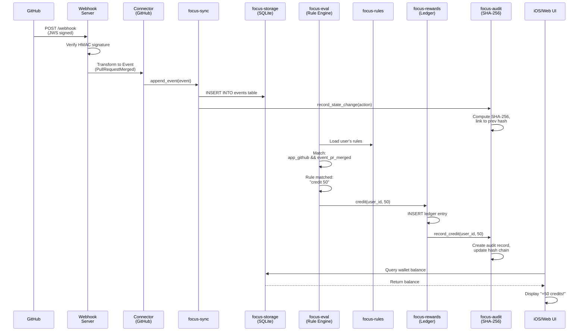
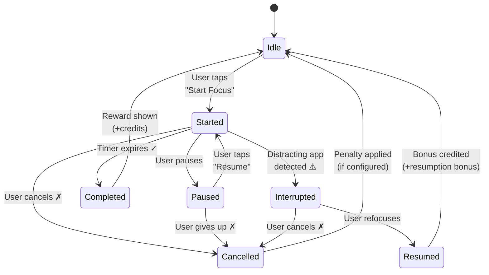

# Architecture Diagrams

Three key diagrams illustrating FocalPoint's design.

## 1. High-Level C4 Context Diagram



## 2. Data Flow: GitHub PR → Credits (Sequence Diagram)



## 3. Focus Session State Machine



Each state transition:
- Creates an audit record (via `focus-audit`)
- May trigger a reward or penalty (via `focus-rewards`, `focus-penalties`)
- Persists to SQLite (via `focus-storage`)
- Is published to UI listeners (via `focus-sync`)

## Key Design Patterns

### Trait-Driven Architecture
All major concerns expose stable traits:
- `Connector`: Implement to add a data source
- `EventStore`: Implement to change persistence backend
- `RuleStore`: Implement to change rule loading
- `ClockPort`: Abstract time for testing
- `SecureSecretStore`: Abstract credential storage

### Audit-Driven State
Every mutation is recorded in the append-only chain:
```
Mutation → AuditRecord → SHA-256 Hash → Previous Hash Link
```
This makes all state transitions reproducible and tamper-evident.

### Layered Evaluation
```
Raw Event → Rule Matcher → Policy Check → Ledger Update → Audit Record
```
Each layer is independently testable; failures are explicit.

## For More Details

- **System Overview:** `/architecture/system_overview`
- **Crates Map:** `/architecture/crates_map`
- **FFI Topology:** `/architecture/ffi-topology`
- **Connector Framework:** `/architecture/connector-framework`
- **Testing Strategy:** `/architecture/testing_strategy`
