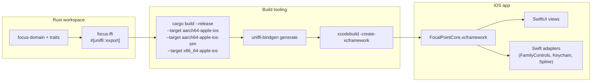

# FFI topology

How the Rust core is exposed to Swift (today) and Kotlin (Phase 2+).

## UniFFI: Rust → Swift

The core's public API is defined in `crates/focus-ffi/src/lib.rs` with `#[uniffi::export]`. `uniffi-bindgen` generates:

- A `.swift` module wrapping the C ABI.
- A `.h` header.
- An `XCFramework`-compatible static library (`libfocus_ffi.a` per target).



## Boundary rules

1. **Owned types only cross the boundary.** No references held across FFI calls; the core hands out opaque handles.
2. **No panics escape.** All `#[uniffi::export]` methods return `Result<T, CoreError>`; unwinds are caught at the boundary.
3. **No blocking on the main thread.** Swift wraps long-running calls (`verify_chain_from_genesis`, `connector_sync`) in `Task.detached`.
4. **No domain types in Swift.** Swift declares nothing of its own for rules, events, or audit records — it consumes `uniffi`-generated Swift enums and structs.
5. **No callbacks without explicit registration.** The core publishes events via a registered `CoreObserver` trait object that Swift implements.

## Error mapping

```
Rust: CoreError enum (thiserror)
  AuthExpired { connector: String }
  RateLimited { retry_after_ms: u64 }
  ChainBroken { at_index: u64 }
  ...
  ↓
UniFFI: Swift enum CoreError: LocalizedError
  .authExpired(connector: String)
  .rateLimited(retryAfter: TimeInterval)
  .chainBroken(atIndex: UInt64)
  ...
```

Every variant has a `LocalizedError` description string authored in Rust and surfaced verbatim in the iOS UI — one source of truth for error copy.

## Android (Phase 2+)

The same `focus-ffi` crate will generate Kotlin via `uniffi-kotlin`. Expected topology:

- Shared `.so` per Android ABI (arm64-v8a, armeabi-v7a, x86, x86_64).
- Gradle plugin packages the `.so` into an `.aar`.
- Kotlin bindings consumed by `apps/android/`.

The trait surface is identical; only the adapter layer changes (UsageStats + Accessibility instead of FamilyControls).

## Build commands

```bash
# iOS (via Taskfile)
task build-ios-sim
task build-ios-device

# Under the hood:
cargo build --release -p focus-ffi \
  --target aarch64-apple-ios \
  --target aarch64-apple-ios-sim \
  --target x86_64-apple-ios
uniffi-bindgen generate --library target/aarch64-apple-ios/release/libfocus_ffi.a \
  --language swift --out-dir apps/ios/Generated
xcodebuild -create-xcframework \
  -library target/aarch64-apple-ios/release/libfocus_ffi.a \
  -library target/aarch64-apple-ios-sim/release/libfocus_ffi.a \
  -library target/x86_64-apple-ios/release/libfocus_ffi.a \
  -output apps/ios/FocalPointCore.xcframework
```

This is scripted in `scripts/build-xcframework.sh` (to be added in Phase 1).
