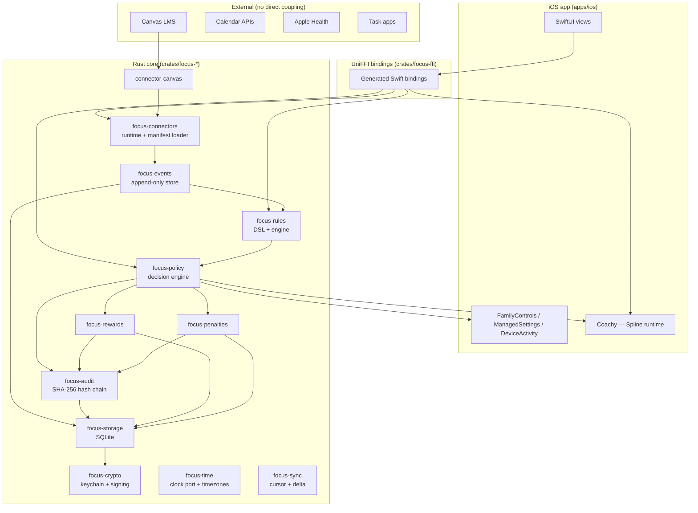

# Architecture overview

FocalPoint is a Rust core + iOS shell. The core owns all domain logic (connectors, events, rules, ledger, audit). The iOS app is a SwiftUI + FamilyControls adapter that calls into the core over UniFFI.

## Layers

## Read more

- [System diagram](/architecture/system-diagram) — deeper view with data flow annotations.
- [Connector framework](/architecture/connector-framework) — trait surface, manifest format, lifecycle.
- [FFI topology](/architecture/ffi-topology) — UniFFI boundaries, ownership, threading model.
- [ADRs](/architecture/adrs) — accepted architecture decisions.

## Design invariants

1. **Core is platform-free.** `crates/focus-*` must build on Linux (CI enforces).
2. **Platform glue owns no state.** Swift and (future) Kotlin hold view state only. Rule state, wallet balances, audit records live in SQLite via `focus-storage`.
3. **All mutation produces an audit record.** Any code path that changes reward balance, penalty state, or policy decision appends an `AuditRecord`.
4. **Traits are stable.** `Connector`, `EventStore`, `RuleStore`, `WalletStore`, `PenaltyStore`, `ClockPort`, `SecureSecretStore` are the public contracts. Changes require an ADR.
5. **Fail loudly.** No silent fallbacks; every error surfaces in the UI with a specific actionable message.
