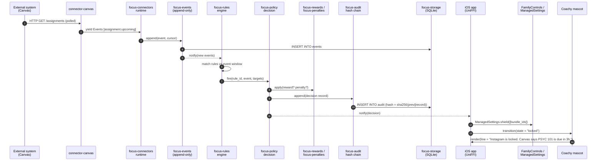

# System diagram

End-to-end view of a single rule-fire cycle, from external event to audited block.

## Data flows

### Inbound (external → core)

1. Connector runtime polls (or receives webhook, where supported).
2. Each raw payload is normalized into one or more `Event` values.
3. Events are appended to `focus-events` with a monotonically increasing cursor.
4. Rules engine subscribes to the event stream; each new event may match one or more rules.

### Outbound (core → platform)

1. Rule match → `Policy` produces a `Decision` (lock-apps, unlock-apps, reward, penalty, notify).
2. `Decision` appends an `AuditRecord` before any side effect.
3. The platform adapter (Swift) observes `Decision` via a UniFFI callback and actuates: `ManagedSettings.store.shield.applications = ...`.
4. `DeviceActivityMonitor` callbacks in Swift relay usage attempts back as `Event`s (for penalty escalation).

### Audit chain verification

At launch, the iOS app calls into `focus-audit::verify_chain_from_genesis`. The function walks every `AuditRecord` in order and recomputes `sha256(prev_hash || record_bytes)`. On mismatch it returns `ChainBroken { at_index, expected, actual }` and the app refuses to operate until the user resolves the break (restore from backup, or accept reset with evidence).

## Threading model

- The core exposes a single `Core` handle. All public methods are `Send + Sync`.
- Under the hood the core uses a single-threaded runtime (`tokio::runtime::Builder::new_current_thread`) for the connector poll loop and a lock-free `crossbeam` channel for event delivery.
- Swift calls UniFFI-bound methods from the main thread; long-running operations (connector sync, full-chain verify) are dispatched to `DispatchQueue.global(qos: .utility)` by the Swift adapter.
