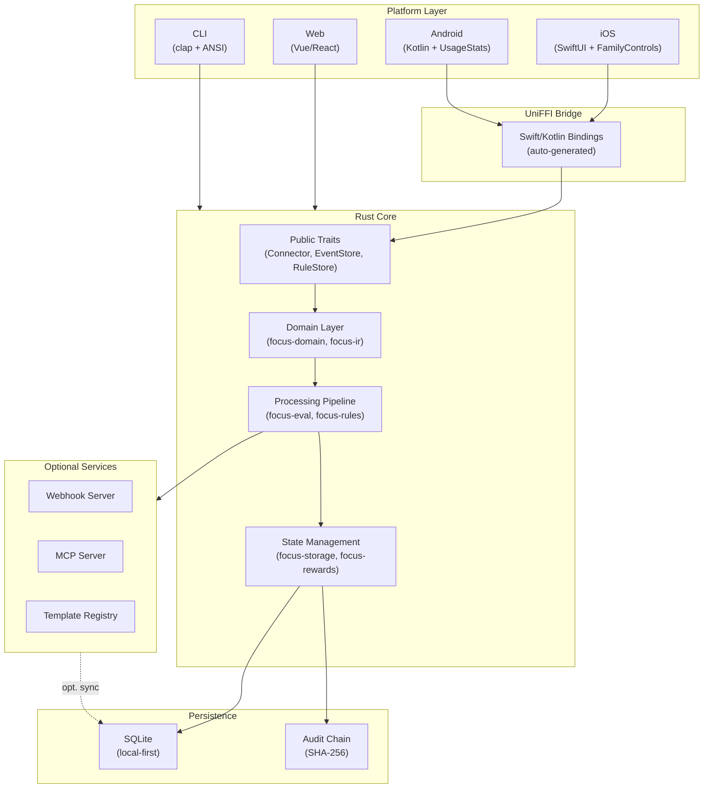
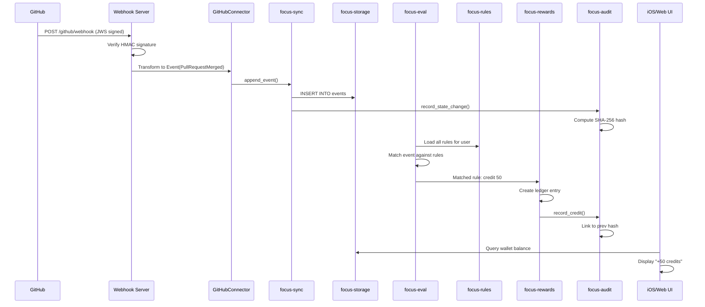
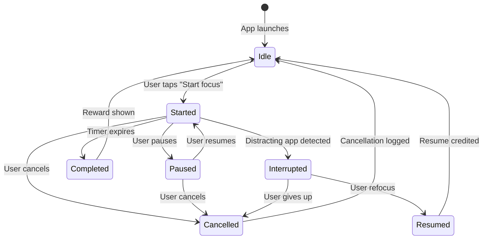

# FocalPoint System Overview

FocalPoint is a connector-first screen-time management platform. It implements a **layered architecture** spanning native platforms (iOS/Android/web/CLI) down to a portable Rust core, with SQLite as the local source of truth.

## Architecture Layers

### 1. Platform Adapters (Top Layer)

Each platform provides platform-specific implementations of three core concerns:

- **ClockPort**: Time queries and event-driven notifications (iOS: `ClockPort::now()` via `DispatchSourceTimer`; Android: `SystemClock.elapsedRealtimeMillis()`)
- **SecureSecretStore**: Credential storage (iOS: Keychain via `SecureEnclave`; Android: EncryptedSharedPreferences)
- **Platform Enforcement** (iOS only, currently): FamilyControls JWS verification, iCloud sync triggers via CloudKit

**iOS/Android Integration via UniFFI:**
- Swift FFI layer in `focus-ffi` exposes the core Rust brain as type-safe Swift interfaces
- Kotlin bindings generated the same way for Android
- **Critical rule**: All domain logic lives in Rust. Platform layers are thin adapters only (no business logic in Swift/Kotlin).

### 2. UniFFI Bridge

The `focus-ffi` crate defines stable Rust-to-native interfaces:

```rust
pub trait ClockPort { fn now() -> DateTime; }
pub trait SecureSecretStore { fn get(key: &str) -> Result<Secret>; }
pub trait Connector { fn poll() -> Future<Event>; }
pub trait EventStore { fn append(event: &Event) -> Result<()>; }
pub trait RuleStore { fn get_rules() -> Vec<Rule>; }
```

UniFFI auto-generates Swift/Kotlin bindings at build time. This is the boundary where the Rust core meets native code.

### 3. Rust Core (Heart of the System)

The Rust workspace contains 40+ crates organized by concern (see **Crates Map** below).

#### Core Domain (Immutable Model)
- **focus-ir**: Intermediate Representation — the canonical rule syntax (JSON-serializable)
- **focus-domain**: Core types (User, Device, Session, FocusSession)
- **focus-events**: Event types (AppOpened, RuleMatched, CreditsEarned, etc.)
- **focus-audit**: SHA-256 append-only audit chain with tamper detection

#### State Management
- **focus-storage**: SQLite adapter (queries, migrations, transactions)
- **focus-sync-store**: In-memory cache layer on top of storage
- **focus-rewards**: Wallet ledger (credits, redemptions)
- **focus-penalties**: Penalty ledger (restrictions, rate-limiting)
- **focus-policy**: Policy engine (entitlements, enforcement rules)
- **focus-entitlements**: Permission model (who can create rules, who can enforce)

#### Processing Pipeline
- **focus-eval**: Rule evaluation engine (matches events against IR rules)
- **focus-rules**: Rule store + compile-time validation
- **focus-planning**: Schedule creation (next session, next break)
- **focus-scheduler**: Task scheduling (via `focus-time`)
- **focus-calendar**: Time-block awareness (busy hours, focus windows)
- **focus-rituals**: Habit sequences (setup, warmup, cool-down)

#### Data Ingestion
- **focus-connectors**: Connector interface (trait + registry)
- **connector-***: 10 connector implementations (GitHub, Canvas, Strava, Fitbit, Notion, Readwise, Linear, Google Calendar, etc.)
- **focus-sync**: Webhook/polling ingestion orchestrator

#### Utility & Packaging
- **focus-crypto**: Encryption/signing (Ed25519 for commits, AES-GCM for secrets)
- **focus-time**: Clock abstraction (testable time travel)
- **focus-lang**: DSL parser (FPL text → IR)
- **focus-transpilers**: Compile IR to platform-specific formats
- **focus-templates**: Template packs (TOML + IR bundle)
- **focus-backup**: Full wallet/policy export with integrity checks
- **focus-coach**: Nudge/feedback generation
- **focus-mascot**: Coachy (the mascot persona and dialogue)

### 4. Services (Optional, Local-First)

Services can run locally or remotely but are **not required** for core functionality.

- **focus-webhook-server**: HTTP endpoint for third-party webhooks (GitHub push events, Canvas submissions)
- **focus-mcp-server**: Claude MCP integration (expose rules/events/audit as Claude tools)
- **focus-ci-watcher**: CI event ingestion (GitHub Actions workflow completions)
- **templates-registry**: Template pack catalog (versioning, search, discovery)
- **focus-release-bot**: Automated release orchestration
- **focus-asset-fetcher**: Download connector logos, rule templates
- **focus-icon-gen**: Generate app icons for templates
- **focus-telemetry**: Anonymous metrics (opt-in)

### 5. Authoring Surfaces

Multiple entry points for creating rules and policies, all **converging to IR**:

1. **FPL (FocalPoint Language)**: Text DSL for rules
   ```fpl
   rule "No TikTok during study hours" {
     when app.name == "com.tiktok" && calendar.is_focus_time()
     then reward --credits 10 && block_app
   }
   ```

2. **CLI** (`focus-cli`): Command-line rule builder
   ```bash
   focus rule create --name "Study Guard" \
     --condition "app=Notion && time=09:00-17:00" \
     --action reward:100
   ```

3. **GUI Builder** (iOS/Web): Drag-and-drop rule composer (generates IR)

4. **Template Packs**: Pre-built rules bundled in TOML (→ IR)

All surfaces compile **down to IR** → stored in SQLite → fed to the evaluator.

## Data Flow: A Concrete Example

**Scenario:** User completes a GitHub PR. FocalPoint credits them and unlocks a reward.

```
1. GitHub Webhook Event
   ↓
2. focus-webhook-server receives POST → parses GitHub JWS
   ↓
3. focus-connectors::GitHubConnector transforms to Event (PullRequestMerged)
   ↓
4. focus-sync appends to EventStore (SQLite) + audit chain
   ↓
5. focus-eval runs rule engine:
   - Match Event against all Rules (from focus-rules)
   - If "GitHub PRs earn 50 credits": trigger action
   ↓
6. focus-rewards::WalletLedger::credit(user_id, 50) → new ledger entry
   ↓
7. focus-audit::AuditChain appends record + SHA-256 hash
   ↓
8. focus-policy checks entitlements:
   - Can this action execute? (user permission, rate limits)
   - Any penalties blocking rewards?
   ↓
9. UI surfaces the result:
   - iOS: SwiftUI view reads from SQLite snapshot
   - Web: REST endpoint returns JSON
   - CLI: Plain text output
   ↓
10. Optional: focus-telemetry (if opted in) sends anonymized event
```

The entire flow is **deterministic and reproducible**. A user can export the audit chain, verify the SHA-256 links, and confirm all credits are legitimately earned.

## Trust Layers

### 1. Commit Signing (DCO)
Rules created via CLI or imported from template packs are signed with Ed25519 (developer's key or embedded template key). Verification happens at import time.

### 2. Audit Chain (SHA-256)
Every state mutation (reward, penalty, policy change) produces an `AuditRecord`:
```rust
pub struct AuditRecord {
    pub timestamp: DateTime,
    pub user_id: Uuid,
    pub action: Action,
    pub prev_hash: Hash256,  // Link to previous
    pub record_hash: Hash256, // This record's hash
}
```
Tampering is detected on startup via chain verification.

### 3. StoreKit JWS (iOS Only)
Receipt validation for in-app purchases (if enabled). Signed by Apple's key; verified before crediting premium features.

### 4. Webhook Signature Verification
Third-party webhooks (GitHub, Canvas, Notion) are verified via HMAC before processing. Unsigned events are dropped.

## Transports

### Local Transports
- **STDIO**: CLI ↔ Rust core via structured JSON
- **Unix Socket**: Native app ↔ Rust daemon (fast, local)
- **SQLite WAL**: Direct database reads (iOS/Android via FFI)

### Remote Transports (Optional)
- **HTTP/REST**: Web UI ↔ remote instance
- **WebSocket**: Real-time sync (rules, credits)
- **Server-Sent Events (SSE)**: Audit trail live updates
- **Webhook Ingestion**: Third-party events (GitHub, Canvas, etc.)
- **CloudKit Sync** (iOS): iCloud backup + cross-device state sync

## State Guarantees

1. **Local-first**: SQLite is the source of truth. Services are optional replicas.
2. **Offline resilience**: All rules, credits, and penalties work without network.
3. **Audit immutability**: The SHA-256 chain is append-only; past records cannot be modified.
4. **Deterministic evaluation**: Same rule + same event always produce the same outcome.
5. **Consistency**: A failed remote sync doesn't corrupt local state.

## Testing Strategy

See `/architecture/testing_strategy` for the full matrix. Key pillars:

- **Unit tests** in each crate (test IR parsing, rule matching, credit calculations)
- **Integration tests** (`tests/e2e`) that spin up a full local instance
- **Snapshot tests** for audit chain verification
- **Property-based tests** for rule evaluation (fuzz the IR)
- **Fixture seed tests** (`focus-demo-seed`) for seeded scenarios

## Diagrams

See the embedded Mermaid diagrams below for visual representations of the architecture, data flow, and focus session state machine.



## Data Flow: GitHub PR → Credits



## Focus Session State Machine



Focus sessions are tracked in `focus-domain::FocusSession`. Each state transition produces an audit record and may trigger rewards or penalties.

## Summary

FocalPoint's architecture is:
- **Modular**: 40+ crates, each with a single responsibility
- **Local-first**: SQLite is always the source of truth
- **Deterministic**: Same input always produces same output (reproducible audits)
- **Extensible**: Connector trait makes adding new data sources trivial
- **Cross-platform**: Rust core works on iOS, Android, web, and CLI via the same interfaces
- **Trustworthy**: SHA-256 audit chain, signed rules, and webhook verification ensure integrity

For deeper dives, see the **Crates Map**, **FFI Topology**, **Connector Framework**, and **Testing Strategy** pages.
