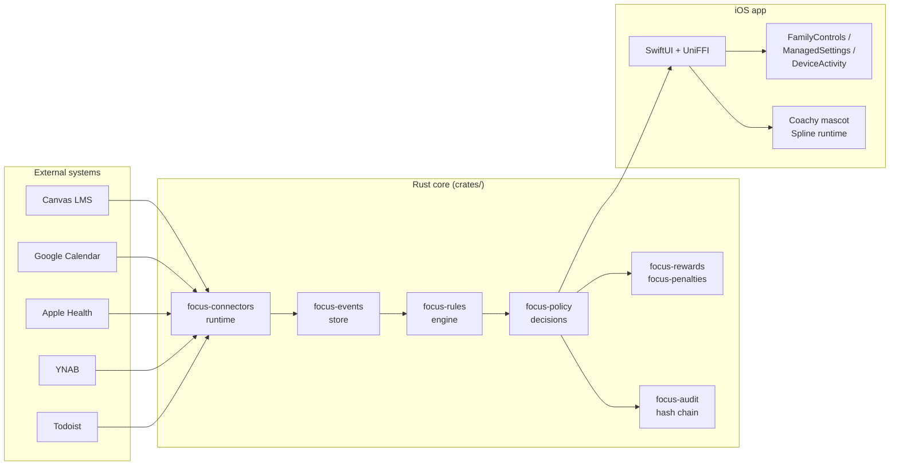

## What problem this solves

Existing screen-time tools fall into two camps:

1. **Pure blockers** (Opal, Freedom, iOS Screen Time's default) — brittle, no context, ignore the *why*. You block Instagram during "work hours", Instagram wins at 2 pm when the assignment isn't due.
2. **Gamified habit trackers** (Forest, Streaks) — reward without teeth. Pretty trees, no behavioral change after week three.

FocalPoint is a **rules platform**. External systems emit events. Rules combine events, state, and schedules into decisions. Decisions produce blocks, rewards, penalties — every one of them explainable and tied to a connector signal you authorized.

## Architecture at a glance



## Quick start

```bash
git clone https://github.com/KooshaPari/FocalPoint.git
cd FocalPoint
task verify
task docs-dev
```

For iOS, see [Install on iOS](/getting-started/install-ios). You will need an Apple Developer account with the `com.apple.developer.family-controls` entitlement approved.

## Roadmap snapshot

| Phase | Status |
|------|-------|
| P0 Scaffold | complete |
| P1 Core crates + UniFFI | in progress |
| P2 Canvas connector + first rule on device | planned |
| P3 Rewards / penalties ledger | planned |
| P4 Connector SDK + marketplace | planned |
| P5 Android | deferred |
| P6 Multi-device sync | deferred |

Full roadmap: [`PLAN.md`](https://github.com/KooshaPari/FocalPoint/blob/main/PLAN.md).

## Acknowledgments

- **Foqos** — donor codebase for the FamilyControls / ManagedSettings harness pattern.
- **MiniMax M2.7** — cheap-LLM routing for docs summarization and rule-template extraction.
- **Kimi K2.5** — secondary routing model for long-context rule DSL generation.
- **Phenotype org shared crates** — `phenotype-event-sourcing`, `phenotype-cache-adapter` patterns echoed in `focus-events` and connector caches.

## License

MIT OR Apache-2.0 at your option. See [LICENSE](https://github.com/KooshaPari/FocalPoint/blob/main/LICENSE).
