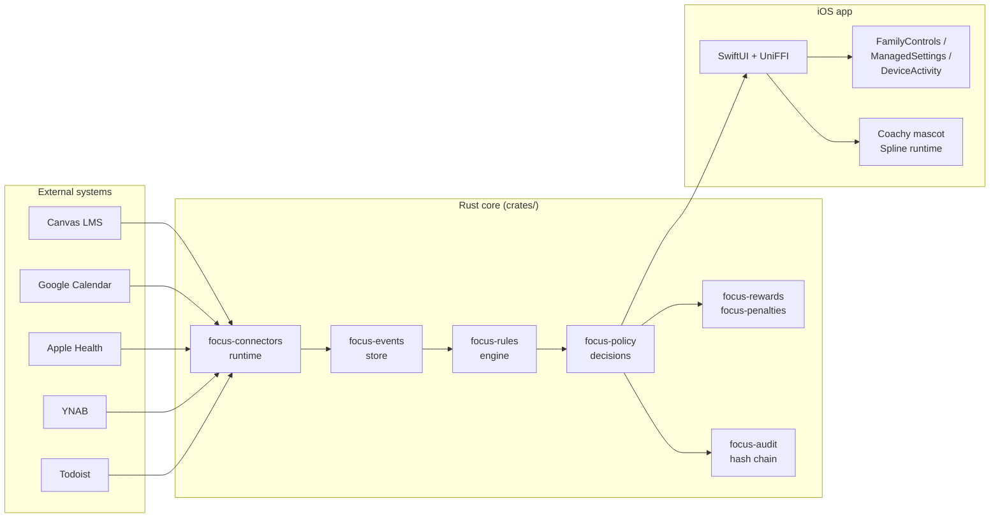

## Problem

Existing screen-time tools fall into two camps:

- **Pure blockers** (Opal, Freedom) — brittle, no context. You block Instagram during "work hours," but Instagram wins at 2 pm when the assignment isn't due.
- **Gamified trackers** (Forest, Streaks) — reward without teeth. Pretty trees, no behavioral change.

FocalPoint is a **rules platform**. External systems emit events. Rules combine events, state, and schedules into decisions. Decisions produce blocks, rewards, penalties—every one explainable and tied to a connector signal you authorized.

## For users

Start here if you're looking to manage your screen time with rules tied to your calendar, assignments, and health.

- **[Quick Start](/getting-started/)** — Install, connect Canvas/Google Calendar/GitHub, write your first rule
- **[User Guides](/guides/)** — Focus modes, rewards, backup, feedback
- **[Journeys](/journeys/)** — Real workflows: student on Canvas, developer with GitHub, sleep wellness

## For developers

Build connectors, rule templates, and theme packs. Extend FocalPoint for your ecosystem.

- **[Plugin SDK](/connector-sdk/)** — Manifest format, event schema, auth flows, testing, verification
- **[Connector Framework](/architecture/connector-framework)** — How connectors integrate
- **[Rule DSL Reference](/rules/dsl)** — Write conditional logic in FPL

## Status

**v0.0.4** — Pre-release. TestFlight pending Apple entitlement review.

| Phase | Status |
|------|-------|
| P0 Scaffold | ✅ complete |
| P1 Core + UniFFI | 🔄 in progress |
| P2 Canvas + first rule on device | ⏸ blocked on entitlement |
| P3 Rewards/penalties ledger | 📋 planned |
| P4 Connector SDK + marketplace | 📋 planned |
| P5 Android | 📋 deferred |

Full roadmap: [PLAN.md](https://github.com/KooshaPari/FocalPoint/blob/main/PLAN.md)

## Architecture

## Community

- **GitHub**: [KooshaPari/FocalPoint](https://github.com/KooshaPari/FocalPoint)
- **Discord**: <DISCORD_URL>
- **Email**: kooshapari@gmail.com

## License

MIT OR Apache-2.0. See [LICENSE](https://github.com/KooshaPari/FocalPoint/blob/main/LICENSE).
