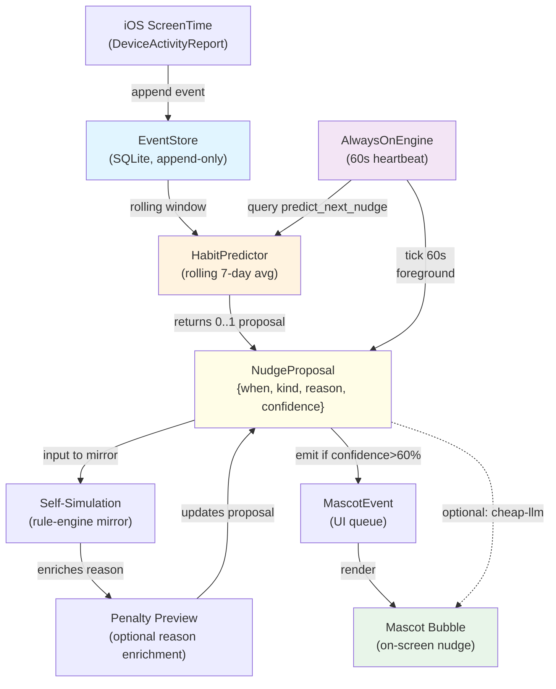

# FocalPoint Always-On Agent Pipeline

## Overview

The always-on agent pattern (per `docs/governance/always_on_agent_design.md`) is adapted for FocalPoint's domain: instead of tracking provider usage and agent session continuity, we track **user focus patterns and distraction risks** to proactively nudge the user toward productive windows and away from pending distractions.

This design document covers:
1. Pattern application to FocalPoint (iOS ScreenTime → habit learning → nudge engine)
2. Data flow diagram
3. Privacy posture
4. Heuristic-based model (MVP) and CoreML upgrade path

## 1. Pattern Application to FocalPoint

### 1.1 Usage Tracker → Screen-Time Event Stream

**What it does:** Continuous collection of iOS ScreenTime events and app categories.

- **Source:** iOS `DeviceActivityReport` + `ActivitySchedule` (delegated to focus-ffi + iOS app)
- **Signal:** `{ timestamp, app_bundle_id, category, screen_on_duration, interruption_count }`
- **Storage:** EventStore (on-device SQLite, append-only with tamper-evident hashing)
- **Granularity:** 1-minute buckets (batched periodically)

**Why:** Raw screen-time data is the foundation for habit learning. By ingesting continuously, we detect shifts in user behavior (new app addiction, unusual all-nighter, meeting overload).

### 1.2 Habit Predictor → Rolling Activity Pattern Analysis

**What it does:** Learns weekly activity patterns from historical focus sessions + event stream.

- **Historical source:** EventStore (rolling 7–30 day window)
- **Signal:** `{ hour_of_week, average_focus_rate, distraction_risk, calendar_deadline_proximity }`
- **Output:** `{ likely_active_windows: Vec<HourOfWeek>, distraction_hours: Vec<HourOfWeek>, sleep_boundary: TimeRange }`
- **Algorithm:** Rolling average (MVP); upgrade to Bayesian in later phases

**Key insight:** Users have weekly rhythms. Monday 9:00 AM is high-productivity time for office workers; Friday 4:00 PM is low. By predicting these windows, we can surface nudges at high-confidence moments.

### 1.3 Always-On Daemon → Foreground Heartbeat + Nudge Emission

**What it does:** The existing 60-second foreground heartbeat + BGTaskScheduler (in focus-ffi) extends to query the habit predictor and emit `NudgeProposal` events.

- **Tick cycle:** 60 seconds (align with focus-ffi heartbeat)
- **Per tick:**
  1. Query `HabitPredictor::predict_next_nudge(now)` → 0 or 1 `NudgeProposal`
  2. Check `NudgeKind` against user's current state (are they sleeping? in a meeting? active focus?)
  3. Emit to `MascotEvent` queue if confidence > 60%
- **Example:** "It's 9:15 AM, you usually deep-work 9:00–11:00. Start a focus session?" (nudge_kind = `StartFocus`, confidence = 0.85)

### 1.4 Self-Simulation → Rule-Engine Mirror

**What it does:** Runs a mirror of the focus rule engine against predicted future events (next 24h) to detect penalties that user would incur if they ignore nudges.

- **Input:** Predicted activity + current penalties + upcoming deadlines
- **Simulation:** "If user ignores this nudge, they'll miss the 5-hour focus window. Their weekly review penalty lands tomorrow at 5:00 PM."
- **Output:** Enriches `NudgeProposal.reason` with penalty preview

**In scope for Phase 1:** Heuristic penalty calculation. In Phase 2+, migrate to reactive simulation (test against live rule engine).

### 1.5 Self-Prompting → Mascot Copy Generation

**What it does:** Generates per-nudge mascot bubble text conditioned on user's predicted mood + historical language patterns.

- **Input:** `NudgeProposal` + user mood (inferred from screen-time volatility, meeting density, sleep depth)
- **Cheap LLM call:** Use cheap-llm-mcp to draft message (e.g., "You've got a big 9-hour window today—let's use it wisely.")
- **Output:** Friendly, non-nagging variant of nudge reason

**In scope for Phase 1:** Template-based copy (no LLM). In Phase 2+, integrate cheap-llm-mcp.

---

## 2. Data Flow Diagram



**Key properties:**
- **On-device first:** EventStore, HabitPredictor, AlwaysOnEngine all local SQLite + Rust
- **Async nudges:** Proposals emitted asynchronously; user can ignore, snooze, or accept
- **No enforcement bridge in Phase 1:** Nudges are advisory (informational mascot bubbles), not blocking

---

## 3. Privacy Posture

### 3.1 On-Device by Default

- **EventStore:** Local SQLite, unencrypted on-disk (encrypted via device lock)
- **HabitPredictor:** Computed locally from event stream; no cloud sync in Phase 1
- **AlwaysOnEngine:** Pure local process; no telemetry emission
- **User events remain private:** Mascot sees nudges, not raw event stream

### 3.2 Optional Cloud Sync (Future)

- **Use case:** Cross-device habit learning (user switches phones, wants history to carry over)
- **Mechanism:** End-to-end encrypted sync to private iCloud folder (per user's iCloud+ plan) or self-hosted Synology
- **Governance:** Disclosed in PRIVACY.md + on-device consent prompt
- **Exclusions:** Personal app names (sensitive categories only); sleep/wake boundaries (not exact times)

### 3.3 Disclosure & Transparency

- **PRIVACY.md** updated to describe:
  - EventStore retention (30-day rolling window by default)
  - Habit predictor training data (anonymized session hours)
  - No external API calls for nudge generation (cheap-llm call is local mock in Phase 1)

---

## 4. Model Story

### 4.1 MVP: Heuristic-Based Habit Predictor (Phase 1)

**Algorithm:** Rolling 7-day average of focus sessions per hour-of-week bucket.

```
Input:
  - EventStore with 7 days of history
  - Bucketing: [Mon 9:00, Mon 10:00, ..., Sun 23:00] = 168 buckets

Computation:
  For each hour-of-week bucket:
    - Count successful focus sessions (session_duration >= 25min AND no interruptions)
    - Compute moving average: avg = Σ(sessions_count) / 7
    - Confidence = avg / max_observed_in_bucket (0.0–1.0)

Output:
  - top_3_hours = highest-confidence hours (threshold: confidence > 0.6)
  - distraction_hours = hours with >3 interruptions on average
  - sleep_boundary = [22:00, 06:00] (hardcoded, refine from wake/sleep detection later)

Nudge Decision:
  IF now.hour_of_week IN top_3_hours
     AND confidence(now.hour_of_week) > 0.6
     AND user NOT in meeting
     AND user NOT sleeping
  THEN emit NudgeProposal { kind: StartFocus, confidence: 0.85 }
```

**Rationale:** Simple, deterministic, no ML infra. Evaluates in <1ms per tick.

### 4.2 Production Upgrade: CoreML On-Device (Phase 2+)

**When ready:** After 30–60 days of user data collection.

- **Model:** Binary classification per hour: `predict(hour_of_week, recent_activity, calendar_density) → focus_likelihood`
- **Inputs:** Historical event stream + calendar events (via focus-calendar connector)
- **Training:** Nightly batch on-device; ~10MB model; inference <10ms
- **Distribution:** Push via App Store update; no versioning complexity

**Benefit:** Better capture of week-to-week variance (e.g., user starts new project → distraction pattern shifts).

---

## 5. Implementation Scope

### Phase 1 (This PR)

✅ **Crate: `focus-always-on`**
- `HabitPredictor` trait + `RollingAverageHabitPredictor` impl
- `NudgeProposal` + `NudgeKind` enum
- `AlwaysOnEngine` wrapping predictor + 60s tick loop
- 6 unit tests covering rolling average, bucketing, sleep suppression, determinism
- **Not wired to focus-ffi yet.** Standalone testable unit.

✅ **Design Doc: `docs/architecture/always_on_agent_pipeline_2026_04.md`** (this file)

### Phase 2 (Follow-up PR)

- [ ] Wire `AlwaysOnEngine` into focus-ffi heartbeat
- [ ] Implement `MascotEvent` enqueuing for nudges
- [ ] Template-based mascot copy generation
- [ ] iOS UI for "accept/snooze/dismiss" nudge interaction

### Phase 3+

- [ ] CoreML model training pipeline
- [ ] cheap-llm-mcp integration for dynamic mascot text
- [ ] Cloud sync infrastructure (encrypted iCloud or self-hosted)
- [ ] Advanced penalty simulation (reactive rule-engine mirror)

---

## 6. Known Unknowns & Future Decisions

| Decision | Impact | Timeline |
|----------|--------|----------|
| Nudge frequency cap (per hour? per day?) | UX delight vs. notification fatigue | Phase 2 (user feedback) |
| Cheap-LLM integration (Phase 1 or Phase 2?) | Copy quality vs. added latency | Phase 2 (deferred) |
| Cross-device sync consent model | Privacy UX, infrastructure cost | Phase 3 (post-launch) |
| Penalty-aware nudging (e.g., "You'll miss a 5h window") | Motivation boost vs. pressure | Phase 2 (UX research) |
| Sleep detection accuracy (current: hardcoded 22:00–06:00) | False negatives on late-night workers | Phase 2+ (pmset integration) |

---

## References

- Canonical always-on design: `/Users/kooshapari/CodeProjects/Phenotype/repos/docs/governance/always_on_agent_design.md`
- FocalPoint CHARTER: `/Users/kooshapari/CodeProjects/Phenotype/repos/FocalPoint/CHARTER.md`
- EventStore trait: `crates/focus-events/src/lib.rs`
- FFI heartbeat: `crates/focus-ffi/src/lib.rs`
