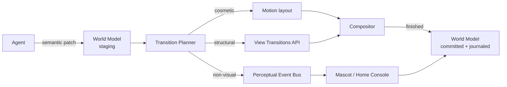
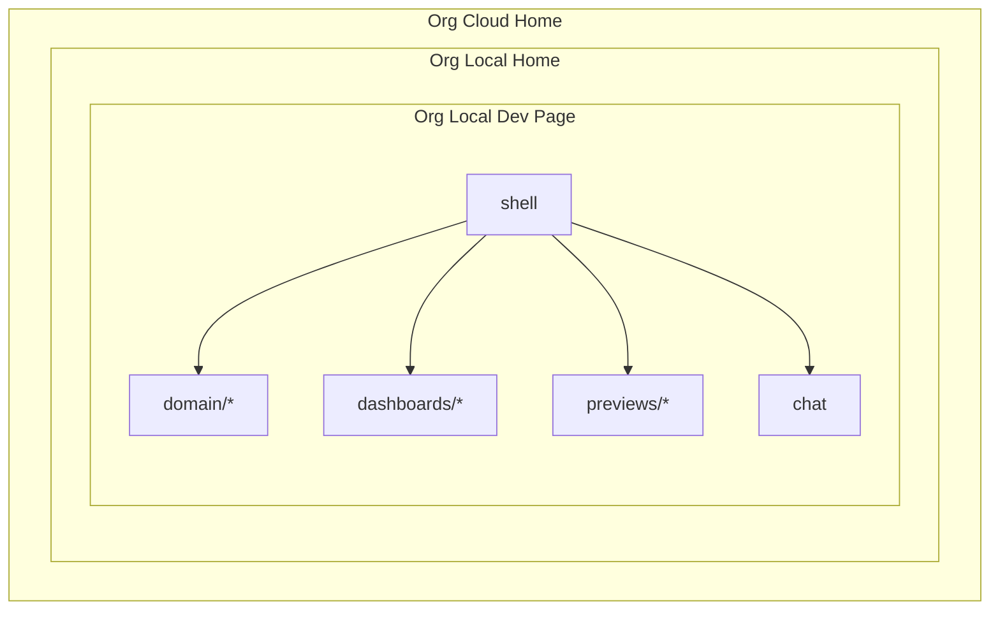
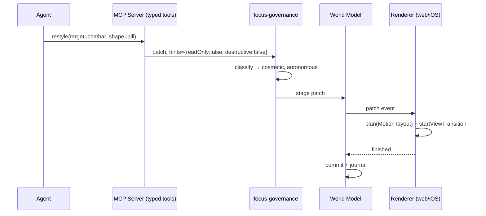
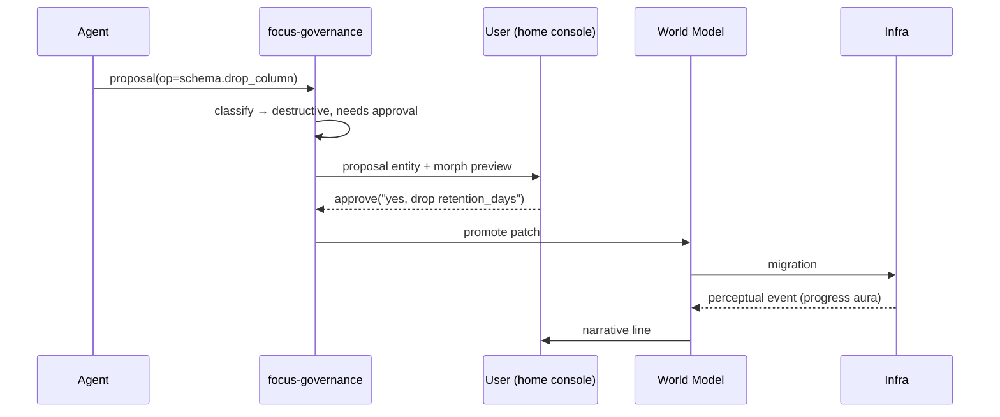
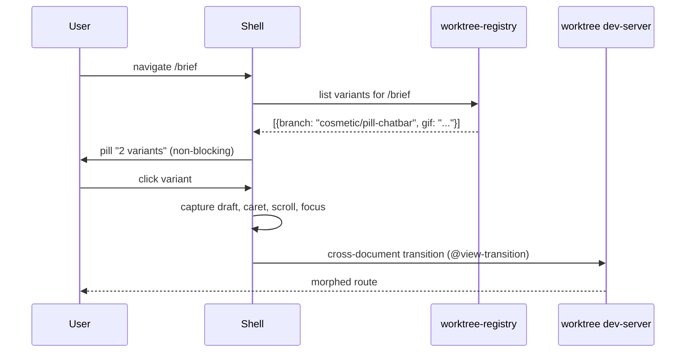

# Living Platform — Design Research

> Planner-agent deliverable. No implementation code. All code references are pseudocode or file-path pointers.
> Status: research draft v0 • Author: Forge planner • Date: 2026-04-23

---

## 1. Vision

A "living platform" is a single, continuously-running application shell whose visual identity changes the way a character in a Pixar film changes: limbs grow, shapes morph, color temperature drifts — nothing remounts, nothing flashes, nothing forgets the draft the user was writing. Today's frontend stacks treat a UI change as a destroy/recreate cycle: the router swaps the tree, React reconciles, the DOM briefly disappears, and the user's scroll, caret, and focus state get paved over. For an environment where a fleet of agents is continuously proposing cosmetic restyles, dashboard rearrangements, and occasionally destructive schema migrations, that default is unacceptable. The shell must be a stable substrate and every change must be a *transition*, not a *reload*.

The second axiom is **one canonical view, many worktrees**. The user runs a single FocalPoint instance pinned to `origin/main`. As the user navigates, the shell quietly checks a local registry of agent-owned worktrees and — when the current route has a buildable alternate — surfaces a non-blocking "preview this variant" affordance with an auto-captured before/after screenshot or short GIF. The user never context-switches to a branch; the shell brings the branch to the route. Worktrees that touch backend/schema/infrastructure are gated behind explicit approval because no amount of smooth animation can undo a dropped table.

The third axiom is **perceptual parity for non-visual change**. Agents mutate backends, indexes, and retention policies that have no native UI. The shell must translate those into UI events the user can *feel*: a progress aura on an entity, a narrative line in the home-console ("rebuilding the ritual index, 32%"), a mascot glance toward the affected surface. Silent backend work is a governance failure, not a feature. The platform's core contract is: **every change that affects the user's world appears in the user's world, as motion**.

---

## 2. Substrate Primitives

The substrate is a set of primitives layered beneath React (or SwiftUI, or a TUI) that together make "morph, don't remount" the default.

1. **Authoritative World Model.** A single normalized in-memory graph (persisted to IndexedDB on web, SQLite on iOS/desktop) that is the source of truth for every rendered surface. Every renderable thing has a stable `entity_id` (ULID) independent of its DOM/view identity. The renderer is a pure projection of this graph; it never owns durable state.
2. **Entity Identity System.** `entity_id` is declared once and stamped onto every rendered element via `data-entity-id` (web) or `.matchedGeometryEffect(id:, in:)` (SwiftUI). The renderer guarantees that the same `entity_id` never unmounts during a transition — only its *representation* changes. This is the load-bearing invariant.
3. **Semantic Patches.** Agents never ship diffs of HTML or component props. They ship *semantic patches* against the world model: `{op: "restyle", target: "chatbar", from: "block", to: "pill"}`, `{op: "relayout", route: "/brief", grid: [...]}`. A patch is a typed contract (Zod/serde schema) that the transition planner consumes.
4. **Transition Planner.** Given a semantic patch, the planner selects a choreography: CSS View Transition for DOM-structural changes, Motion layout animation for position/size, a custom morph tween for SVG/shape, or a "perceptual event" for non-visual changes. The planner is deterministic and testable — same patch, same choreography.
5. **Compositor (Old+New Snapshot Hold).** For cross-document or structural changes, the planner hands off to the View Transitions API, which snapshots the old tree, renders the new one, and cross-fades/morphs between them using CSS `::view-transition-*` pseudo-elements ([MDN View Transition API](https://developer.mozilla.org/en-US/docs/Web/API/View_Transition_API), accessed 2026-04-23). Chrome 126+, Edge 126+, Safari 18.2+ support cross-document; Firefox still pending as of 2026-04 ([caniuse](https://caniuse.com/view-transitions), accessed 2026-04-23). In-page transitions (`document.startViewTransition`) are universally supported since Firefox 133.
6. **Commit.** Only after the transition's `finished` promise resolves does the patch become canonical in the world model's journal. If the transition is interrupted (navigation, error), the world model reverts — *the visual state is the committed state*.



---

## 3. Change Taxonomy

| Class | Example | Choreography | Latency budget |
|---|---|---|---|
| **Cosmetic** | chatbar block → pill; palette shift | Motion `layout` prop + CSS custom-property tween | < 400ms |
| **Layout** | dashboard grid reorder; panel split | View Transitions API + `view-transition-name` per entity | < 800ms |
| **Structural** | new route inserted; component swapped for richer variant | Cross-document `@view-transition` + shared `view-transition-name` anchors | < 1.5s |
| **Data** | field renamed; list re-sorted; new column | Entity-level morph with old→new value tween; preserve identity | < 600ms |
| **Infrastructure** | DB index rebuild; retention change; vendor swap | Perceptual event only (progress aura, console narrative, mascot glance) | N/A, reports duration |

The `< 15s chatbar-morph` budget from the source dump slots into **Cosmetic**. The 15 s is *total* from agent decision to transition finished; the animation itself should be 300–500 ms. The remaining budget absorbs patch validation, build/HMR, and planner scheduling.

Motion (formerly Framer Motion) handles cosmetic and data classes via its FLIP-based layout engine, which corrects for scale distortion — important when a pill stretches from a block ([Motion React Layout Animations](https://motion.dev/docs/react-layout-animations), accessed 2026-04-23). View Transitions handles layout and structural, because it can snapshot across remounts. Combining them naively double-animates; the planner arbitrates.

---

## 4. Non-Negotiables

These must survive **every** transition, regardless of class:

- **Draft text** — all `<textarea>`, `<input>`, `contenteditable` content keyed by `entity_id`, persisted to IDB on every change, rehydrated post-transition. Swift: `@AppStorage` or a dedicated `DraftStore` actor.
- **Caret & selection** — `Range` captured pre-transition, restored post. Cross-document uses a handoff token in `sessionStorage`.
- **Focus** — `document.activeElement`'s `entity_id` captured and refocused. Swift: `@FocusState` preserved across view rebuilds.
- **Scroll position** — per-entity scroll offset in the world model, not browser history. Restored after layout settles.
- **Mascot state** — the `focus-mascot` crate owns a long-lived animation state machine; transitions must pipe its current pose through, not reset it.
- **Focus-session timers** — the `focus-rituals` timer is authoritative in the Rust core; UI just reads. A UI transition cannot pause or reset the timer — only an explicit ritual-domain event can.

Violation of any of these is a bug, not a tradeoff.

---

## 5. Governance Gates

Agents operate under a two-tier capability model driven by patch-op type:

**Autonomous (no prompt):**
- `restyle` — color, radius, shadow, type scale, density
- `rearrange` — dashboard panel order, sidebar grouping
- `copy-edit` — microcopy, labels, tooltips (non-legal)
- `perf-hint` — lazy-load, prefetch, virtualization toggles

**Requires explicit approval (modal morph-preview + typed confirmation):**
- `auth` / `billing` / `destructive-mutation` — anything affecting identity, money, or irrecoverable data
- `schema` — migration, column add/drop, index rebuild
- `retention` — log/data lifetime changes
- `external-call` — new outbound network targets
- `permission-grant` — new capabilities added to an agent

**Approval flow spec:**
1. Agent emits a `proposal` patch to the governance bus (not the world model).
2. Shell materializes a non-blocking "Proposed change" entity in the home-console, with a before/after morph preview (Playwright-captured GIF for web, SwiftUI preview snapshot for iOS).
3. User confirms by typed keyword (for destructive) or single tap (for non-destructive).
4. On approval, patch is promoted to world-model staging and flows through the normal planner.
5. On reject or 24 h timeout, patch is journaled as declined and the agent is notified.

The bus, preview capture, and journaling live in a new `focus-governance` crate (proposed) — distinct from `focus-policy`, which is already the domain-rules engine.

---

## 6. Microfrontend Scaffold

The user's source dump asks for three nesting levels: **org-local dev page** embedded in **org-local home** embedded in **org cloud home**. Module Federation 2.0 reached stable in April 2026 with runtime decoupled from the bundler ([InfoQ: MF 2.0 stable](https://www.infoq.com/news/2026/04/module-federation-2-stable/), accessed 2026-04-23), making this practical without vendor lock-in. Rspack is the recommended host bundler — same API as Webpack 5 MF, ~10× build speed ([Rspack MF guide](https://rspack.rs/guide/features/module-federation), accessed 2026-04-23).

Federation boundaries:

| Remote | Owner | Contents |
|---|---|---|
| `shell` | host | Chrome, nav, world model, transition planner, governance bus |
| `domain/*` | one per domain | `domain/rituals`, `domain/calendar`, `domain/coaching` — route modules |
| `dashboards/*` | observability | `dashboards/otel`, `dashboards/qa`, `dashboards/sentry` — embedded panels |
| `previews/*` | worktree registry | one remote per buildable worktree, served from local dev server |
| `chat` | apps-sdk | ChatGPT Apps SDK / MCP Apps iframe, typed tool hints surface |



Each nesting level is a separate MF host; inner shells register as remotes of their outer. The world model is federated via the MF 2.0 runtime plugin API — child shells see a read-only projection; writes bubble to the outermost shell that owns the journal.

Dashboard embedding: avoid iframe-in-iframe by preferring OTel backends with first-class microfrontend exposure. SigNoz and Uptrace expose React components; Grafana still requires iframe + JWT auth ([SigNoz Grafana embed guide](https://signoz.io/guides/how-to-authenticate-and-embedded-grafana-charts-into-iframe/), accessed 2026-04-23). Preference order: **SigNoz → Uptrace → Jaeger UI → Grafana (iframe fallback)**.

---

## 7. Worktree-Aware Route Switching

Local-first design — no Vercel, no Gitpod. The user already has `.worktrees/<project>/<branch>/` on disk (visible in git status). A new `focus-worktree-registry` service (Rust, runs as part of dev-env) watches for worktrees that:

1. Build successfully (`task quality` green),
2. Declare a route mapping in their `focalpoint.worktree.toml` (e.g. `route = "/brief"`),
3. Have been captured within the last build (screenshot/GIF artifact under `.worktree-captures/<branch>/<route>.gif`).

Capture pipeline: Playwright-triggered on post-build hook. 3-second GIF recording of the route in an idle state, plus a static PNG of "after first interaction". Artifacts live in `.worktree-captures/`, which is git-ignored but indexed by the registry.

Surfacing: when the user lands on a route, the shell queries the registry for matching worktrees and renders a subtle pill in the chrome — `"2 variants available"` — that expands on hover to a gallery of GIF thumbnails. Clicking a thumbnail performs a **cross-document view transition** into the worktree's dev-server URL (`http://localhost:<worktree-port>/<route>`), using shared `view-transition-name` anchors on the chatbar, hero, and primary CTA so the morph between `origin/main` and the worktree variant is a continuous animation, not a page load.

This pattern is only possible because cross-document view transitions landed in Chrome/Safari ([Chrome: What's new in view transitions 2025](https://developer.chrome.com/blog/view-transitions-in-2025), accessed 2026-04-23); Firefox users get a crossfade fallback.

---

## 8. Non-UI Change Translation

Backend, schema, index, retention, and infra changes emit to a **perceptual event bus**. Event schema:

```
{
  event_id: ULID,
  source: "backend.schema" | "backend.index" | "infra.retention" | ...,
  affects: [entity_id],         // which world-model entities see ripple
  narrative: "Rebuilding ritual index (32%)",
  progress: 0.32 | null,
  severity: "info" | "warn" | "destructive",
  correlate_to: patch_id | null,
}
```

Rendering channels:
- **Progress aura** — a CSS `backdrop-filter` halo around affected entities, opacity ∝ progress, hue by severity.
- **Home-console narrative** — append-only log in the mascot's speech area; each line morphs in from below.
- **Mascot glance** — the `focus-mascot` state machine accepts a `glanceAt(entity_id)` transition, animating gaze toward the affected surface.
- **Dashboard tile** — OTel dashboard auto-expands the corresponding SigNoz panel when severity ≥ warn.

This means even a silent `REINDEX CONCURRENTLY` has a UI footprint — a ritual card briefly glows, the mascot glances at it, the console says "index healthy again". The user knows agents are *doing* things without agents ever saying "look at me".

---

## 9. FocalPoint Minimal Slice — Morning Brief

Smallest useful experiment. Scope:

- **Route**: `/brief` (the Morning Brief view, currently served by `apps/web-admin` + `crates/focus-rituals`).
- **Capability**: an agent may autonomously restyle the chatbar (block↔pill, radius, density) and the hero typography scale during *idle windows only* (no active ritual, no focus timer running).
- **Preservation**: today's `intention_draft` entity must survive; caret position in the draft must survive; mascot pose must survive.
- **Morph**: chatbar shape change animates in 300–500 ms using View Transitions + Motion layout; color/type changes use CSS custom-property tween.
- **Journal**: every autonomous restyle records `{agent_id, patch, before_snapshot, after_snapshot, user_dwell_after}` so that preferences can be learned.

Estimate, in agent-time:

- Entity-ID audit of `/brief` surfaces → 6–8 tool calls, ~5 min.
- `focus-governance` crate stub + patch schema → 10–12 tool calls, ~8 min.
- World-model staging + journal in `focus-domain` → 12–15 tool calls, ~10 min.
- Transition planner (cosmetic-only path) → 8–10 tool calls, ~7 min.
- Web renderer wiring (`apps/web-admin`) with Motion + View Transitions → 15–20 tool calls, 3 parallel subagents, ~15 min.
- Draft/caret/scroll preservation hooks → 6–8 tool calls, ~5 min.
- Playwright capture for worktree registry → 8–10 tool calls, ~7 min.
- End-to-end smoke + FR traceability → 6 tool calls, ~5 min.

**Total: ~60 min wall-clock, ~90 tool calls across ~4 parallel subagent batches.** Well under the user's 3-week ceiling; realistic in a single focused session. iOS parity is **out of scope for the slice** — see `01_focalpoint_slice.md`.

---

## 10. Reference Architecture

React + Rust core + Postgres + typed tool contracts + event bus.

- **Rust core** (`crates/focus-domain`, `focus-rituals`, `focus-governance`): world-model journal, patch validation, transition planner (pure functions), perceptual event bus.
- **React shell** (`apps/web-admin`): MF 2.0 host, Motion for layout, View Transitions API for structural, IndexedDB mirror of world model, patch consumer.
- **SwiftUI shell** (`apps/ios`): same world model via `focus-ffi`; `matchedGeometryEffect` + `withAnimation` replace View Transitions.
- **Postgres**: authoritative journal + event bus persistence; LISTEN/NOTIFY feeds the perceptual bus to all shells.
- **Typed tool contracts**: MCP server exposes patches-as-tools with `readOnlyHint`, `destructiveHint`, `idempotentHint` annotations ([OpenAI Apps SDK — MCP server](https://developers.openai.com/apps-sdk/build/mcp-server), accessed 2026-04-23). The governance gate in §5 maps 1:1 to these hints.
- **Event bus**: NATS or Postgres LISTEN/NOTIFY; all shells subscribe.

### 10a. Sequence — autonomous cosmetic change



### 10b. Sequence — destructive proposal



### 10c. Sequence — worktree preview offer



---

## 11. Non-Web Presentations

**CLI (`focus-cli`):** patches render as colored unified-diff with "morph narrative" header lines — e.g. `~ chatbar: block → pill (radius 4→999, px 12→24)`. Destructive patches print a typed-confirmation prompt. Uses `indicatif` for progress-aura analog; `comfy-table` for layout diffs.

**TUI (kitty-graphics capable, via `rich-cli`):** terminal capability-detected (`$TERM`, `$KITTY_WINDOW_ID`). When supported (kitty, Ghostty, WezTerm), render actual before/after images with a 400 ms fade via the kitty graphics protocol; otherwise fall back to ASCII diff. Focus-timer ticker animates in place.

**API (JSON):** patches expose a `/v1/patches` endpoint; clients subscribing to SSE `/v1/perceptual-events` receive the same bus that drives UI auras. Third-party clients can implement their own morph renderers from the same contracts.

The binding principle: the **patch** and the **perceptual event** are the platform's lingua franca. Every surface — web, iOS, CLI, TUI, API — is a renderer over those two streams. Parity is enforced by a shared contract-test suite in `crates/focus-events`.

---

## 12. Open Questions / Research Followups

1. **View Transitions + React 19 `<Activity>`.** Activity unmounts but preserves state; interaction with `view-transition-name` unclear. Needs a spike.
2. **Firefox fallback UX.** Crossfade is fine for cosmetic; unacceptable for structural. Investigate polyfill quality.
3. **MF 2.0 + SwiftUI.** MF is web-only; iOS needs an analog — possibly dynamic `AnyView` registry driven by the same patch stream. Research `swift-composable-presentation` or build.
4. **Playwright capture cost.** Each worktree × each route × each change = GIF. Disk budget? Investigate `webp` animation vs GIF; expect 5–10× reduction.
5. **Mascot morph across transitions.** If the mascot itself is restyled by an agent, its own animation state machine must morph — recursion case. Needs a design pass.
6. **Approval fatigue.** If every destructive proposal requires typed confirmation, batching semantics need design (approve-all-schema-for-this-session?).
7. **MCP Apps iframe postMessage + view transitions.** Can a view transition span the host + an Apps SDK iframe? Likely no — iframes are their own document. Design the handoff.
8. **Local-first OTel.** SigNoz requires ClickHouse; heavy for local dev. Investigate `otel-desktop-viewer` as minimal local dashboard remote.

---

## Sources

- [MDN — View Transition API](https://developer.mozilla.org/en-US/docs/Web/API/View_Transition_API) (accessed 2026-04-23)
- [caniuse — View Transitions API](https://caniuse.com/view-transitions) (accessed 2026-04-23)
- [Chrome Developers — What's new in view transitions (2025)](https://developer.chrome.com/blog/view-transitions-in-2025) (accessed 2026-04-23)
- [Motion — React Layout Animations (FLIP + shared element)](https://motion.dev/docs/react-layout-animations) (accessed 2026-04-23)
- [InfoQ — Module Federation 2.0 Reaches Stable Release (Apr 2026)](https://www.infoq.com/news/2026/04/module-federation-2-stable/) (accessed 2026-04-23)
- [Rspack — Module Federation guide](https://rspack.rs/guide/features/module-federation) (accessed 2026-04-23)
- [OpenAI Developers — Apps SDK Quickstart](https://developers.openai.com/apps-sdk/quickstart) (accessed 2026-04-23)
- [OpenAI Developers — Build your MCP server (tool hints)](https://developers.openai.com/apps-sdk/build/mcp-server) (accessed 2026-04-23)
- [OpenAI Developers — MCP Apps compatibility in ChatGPT](https://developers.openai.com/apps-sdk/mcp-apps-in-chatgpt) (accessed 2026-04-23)
- [SigNoz — Embedding Grafana with authentication](https://signoz.io/guides/how-to-authenticate-and-embedded-grafana-charts-into-iframe/) (accessed 2026-04-23)
- [Uptrace — OpenTelemetry backends](https://uptrace.dev/blog/opentelemetry-backend) (accessed 2026-04-23)
- [Northflank — 10 best preview environment platforms (2026)](https://northflank.com/blog/preview-environment-platforms) (accessed 2026-04-23)
- [SwiftUI Lab — matchedGeometryEffect Part 1 (Hero Animations)](https://swiftui-lab.com/matchedgeometryeffect-part1/) (accessed 2026-04-23)
- [Hacking with Swift — matchedGeometryEffect synchronization](https://www.hackingwithswift.com/quick-start/swiftui/how-to-synchronize-animations-from-one-view-to-another-with-matchedgeometryeffect) (accessed 2026-04-23)
