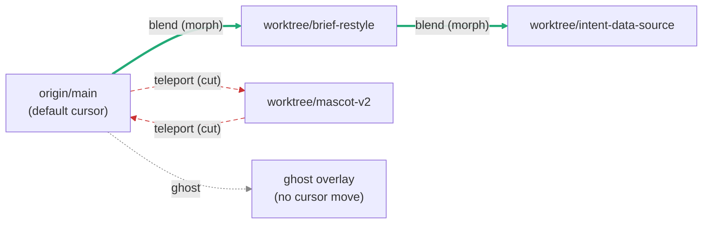

# 02 — Discrete Swap vs Continuous Morph

> Companion to `00_design.md` and `01_focalpoint_slice.md`. This document reconciles the two axes surfaced after the main design was kicked off: the **multiverse/tree-like** model (worktrees as discrete, swappable branches of reality) and the **continuous, living platform** model (one canonical surface that *moves* as reality is reshaped).

## 0. Framing

> "we need to balance multiverse/tree-like App and a continuous living one, e.g. first one is the discrete swappability, vs continuous movement of central or currently centered canonical."

The tension is not real. It is a verb problem disguised as a noun problem.

- **Tree is the state.** Worktrees, branches, and checkpoints are discrete nodes in a DAG. Nothing about a DAG forces either a cut or a morph.
- **Morph is the transition.** The living surface is not a *different* world from the tree — it is the *animation* between two tree nodes. The DAG stays discrete. The camera through it is continuous.
- **Canonical is a cursor.** There is no god-node. `origin/main` is merely the default position of the cursor when the app opens. Moving the cursor is the only way the user ever experiences "the canonical."

From this, three transition verbs fall out naturally.

## 1. The Three Verbs

### Teleport — discrete swap, no morph

Semantic: *"Show me worktree X, entirely, as it is."*

UX: The canvas fades to black for ~120ms, then composes the new worktree from scratch. No element-to-element continuity is attempted. Narrative strip: `Teleported to worktree/mascot-v2 · 14 entities replaced · 3 preserved by identity`.

When forced: an entity's component type changed, or its parent identity chain is broken. The planner cannot honestly animate a cut, so it refuses to pretend.

### Blend — morph the changed, cut the unrelated

Semantic: *"Try this worktree's changes in my current session."*

UX: Each entity with stable ID animates in place (position, size, color, copy interpolate over ~300ms). Entities that exist on only one side cross-fade. Entities with broken identity hard-cut inside the blended scene. Narrative strip: `Blended worktree/brief-restyle · 3 morphed · 1 cut · session preserved`.

Blend is the default verb for cosmetic and layout changes against the current cursor.

### Ghost — overlay preview without committing

Semantic: *"Show me what would change if I teleported or blended, without moving the cursor."*

UX: The worktree's version is rendered as a translucent overlay pinned to each affected entity. Hover an entity to see its diff inline. Dismissing the ghost leaves the cursor untouched. Narrative strip (persistent toast): `Ghosting worktree/mascot-v2 · cursor still at origin/main`.

Ghost is always free — no governance, no commitment, no state mutation.

## 2. Identity-Continuity Algorithm

Every entity carries a **stable ID** (`entity.id`), a **component type** (`entity.kind`), and a **parent chain** (`entity.parents: [id, ...]` — slot, region, surface, root). Given worktree diff `W` against current cursor `C`, the planner decides a verb per entity, then aggregates.

```text
plan_transition(C, W):
  per_entity = {}
  for E in union(entities(C), entities(W)):
    cE = lookup(C, E.id)
    wE = lookup(W, E.id)

    if cE and not wE:
      per_entity[E.id] = CUT_OUT          # existed, now gone
    elif wE and not cE:
      per_entity[E.id] = CUT_IN           # new, no prior to morph from
    elif cE.kind != wE.kind:
      per_entity[E.id] = TELEPORT_FORCED  # component type changed
    elif parent_chain_broken(cE, wE):
      per_entity[E.id] = TELEPORT_FORCED  # reparented through non-morphable ancestor
    elif diff_is_cosmetic_or_layout(cE, wE):
      per_entity[E.id] = BLEND            # interpolatable
    elif diff_is_structural(cE, wE):
      per_entity[E.id] = BLEND_BEST_EFFORT  # morph what we can, cut the rest
    elif diff_is_data_only(cE, wE):
      per_entity[E.id] = BLEND            # value interpolation or crossfade
    else:
      per_entity[E.id] = TELEPORT_FORCED

  # Aggregate to a scene verb.
  if any(v == TELEPORT_FORCED for v in per_entity.values()) and
     fraction(TELEPORT_FORCED) > 0.3:
    return Teleport(per_entity)
  if all(v in {BLEND, BLEND_BEST_EFFORT, CUT_IN, CUT_OUT} for v in per_entity.values()):
    return Blend(per_entity)
  return Teleport(per_entity)  # mixed-mode defaults to honest cut

parent_chain_broken(cE, wE):
  # Walk both parent chains. If any ancestor pair has different IDs or
  # different kinds, the entity has been re-homed and morphing would lie.
  return zip(cE.parents, wE.parents).any(lambda (a, b): a.id != b.id or a.kind != b.kind)
```

**Edge cases worth naming** (surfaced while writing this):

- *Identity collision under rename:* a worktree renames entity `mascot` → `mascot-legacy` and introduces a *new* `mascot` of a different kind. The stable ID rule saves us — IDs are generated, not name-derived.
- *Stable ID, unstable kind:* a card that was `Card.Text` on C and `Card.Chart` on W shares its ID but its kind differs — teleport is forced even if the parent chain is intact. Morphing text-to-chart is a lie.
- *Partial parent re-home:* entity stays under the same region but its slot ID changed. This counts as broken. Slot identity is load-bearing for layout intent.
- *Ghost-while-blending:* user ghosts worktree Y while already mid-blend against X. The ghost renders against the *current interpolated* frame, not against C. Documented as a feature, not a bug.

## 3. Cursor Semantics

- **Default position:** on app open, cursor sits at `origin/main` at the tip observed at session start. Not "latest"; not "whatever the agent last focused." Explicit snapshot.
- **Cursor history:** back/forward traverse a per-session linear history of cursor positions. Branching exploration does not branch history — it appends.
- **Cursor bookmarks:** named positions (`cursor:brief-sketch`, `cursor:mascot-v2`). Bookmarks survive session end; history does not.
- **Cursor-on-entity (partial cut-over):** the user may pin a single entity's identity to a worktree version while the scene cursor stays at C. Rendered with a subtle pin badge. The entity is now sourced from W for that ID; the rest of the scene ignores W. Lets the user "taste" a single card's restyle without committing the session.
- **Agent cursor policy:** the agent can ghost freely, can blend cosmetic-only diffs autonomously, must propose teleports, and can never silently advance the cursor. A cursor move is a user-visible commit.

## 4. Change Taxonomy × Verb Eligibility

Cross-reference with the change taxonomy in `00_design.md`:

| Change class | Blend | Teleport | Ghost | Notes |
|---|---|---|---|---|
| Cosmetic | yes (agent auto) | allowed | yes | Default path. |
| Layout | yes | allowed | yes | Morph position/size; FLIP-style. |
| Structural | best-effort blend | preferred | yes | Agent must propose. |
| Data | yes | allowed | yes | Value interpolation or crossfade. |
| Infra | no | required | yes | Runtime, auth, transport — no animation survives these. |

## 5. Cursor Through the DAG



Solid green edges = morph (blend). Dashed red edges = cut (teleport). Dotted grey = ghost (no cursor move).

## 6. CLI / API Presentation

Not every surface animates. The verbs must read cleanly in a terminal too.

```bash
$ focalpoint ghost worktree/mascot-v2
ghosting worktree/mascot-v2 against origin/main
  ~ mascot.engine      kind changed: Sprite -> WebGL   [would force teleport]
  ~ brief.card         style drift                      [would blend]
  + settings.audio     new entity                       [would blend]
cursor unchanged.

$ focalpoint blend worktree/brief-restyle
renaming 3 entities in place:
  brief.card           morph  (~300ms, cosmetic)
  brief.card.header    morph  (~300ms, layout)
  brief.card.subtitle  morph  (~300ms, cosmetic)
1 entity preserved by identity: intent.draft
cursor: origin/main  ->  origin/main + worktree/brief-restyle (blended)

$ focalpoint teleport worktree/mascot-v2
identity chain broken on: mascot.engine (Sprite -> WebGL)
blend refused. teleporting.
cursor: origin/main -> worktree/mascot-v2
14 entities replaced. 3 preserved by identity: intent.draft, settings.audio, user.session
```

The narrative output mirrors `mv`: name, verb, why. Identity preservation is always called out explicitly, because it is the user's contract with the surface.

## 7. Two FocalPoint Examples

### (a) Worktree rewrote Morning Brief styling → **Blend**

Diff: `brief.card` kind unchanged (`Card.Summary`), parent chain intact (`root > home > brief-region > brief.card`), only tokens and copy changed. Taxonomy: cosmetic + layout. Identity algorithm returns `BLEND` per entity; aggregate stays `Blend`. The card morphs tokens and copy in-place. The user's half-written intent draft, owned by `intent.draft` with its own stable ID, is untouched because no diff entry names it.

### (b) Worktree replaced the Mascot engine → **Teleport**

Diff: `mascot.engine` kind changed from `Sprite` to `WebGL`. Parent chain is intact, but the kind change alone trips `TELEPORT_FORCED`. Aggregate escalates to `Teleport` because mascot is a high-visibility entity and `fraction(TELEPORT_FORCED)` exceeds the threshold. Blend is refused on honesty grounds — there is no meaningful interpolation between a 2D sprite sheet and a WebGL scene. The user gets a 120ms cut, and the narrative strip says so.

## 8. What This Buys Us

- **One mental model.** The DAG never disappears. The animation never lies.
- **Agent autonomy with a leash.** Cosmetic blends run silently; anything that breaks identity bubbles up as a proposal.
- **No god-node.** `origin/main` is convention, not cosmology. The cursor is the only thing the user ever really points at.
- **Ghost as a first-class verb.** Preview without commitment is the cheapest way to make a living platform feel safe.
