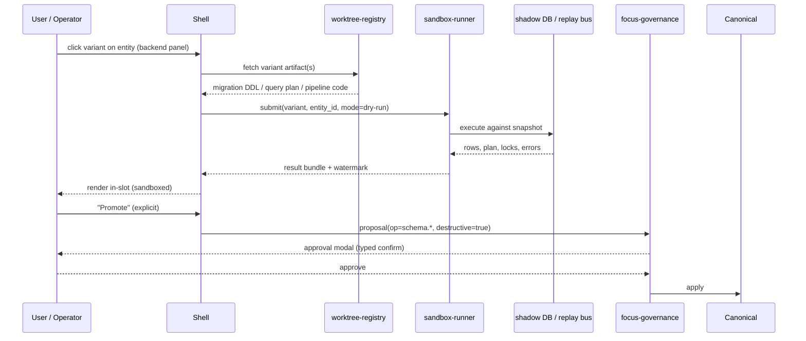

# 03 — Per-Element Variants and Catch-Up Notifications

> Companion to `00_design.md`, `01_focalpoint_slice.md`, `02_discrete_vs_continuous.md`. Planner-agent deliverable; no implementation code.
>
> This doc extends the discrete-vs-continuous reconciliation from `02` with two user-visible affordances: (a) a **per-element variant gallery** surfaced by an *offer-glow*, letting the user (or a backend operator) pick among up to N parallel worktree-built variations of a single entity; and (b) **catch-up notifications** that keep the passive living flow honest when the focused base advances past the cursor.
>
> Source constraint (user, paste-literal): *"it should remain that its easy for a user to go as far as clicking on an element (or seeing its glowing around it), or a backend oriented feature providing similar way to perform the interaction -> option to switch to N (lets say 3 screen gallery popup box shown) different active variations. most cases that make it so agents do not simply work by feature flag is because its wasteful in terms of time (that agent may be literally doing a migration that just isnt merged yet, or its a generally mutually exclusive change) and theres a lot of other edge cases. in the same sense the living aspect remains as the overall passive flow of whatever timeline we are currently on, with popups to return to the newest measured latest when there's an update. showing commit messages and/or synthesizing to understandable user labels where possible in those notis"*

---

## 1. Per-Element Variant Gallery

### 1.1 The offer-glow interaction

Every entity with at least one eligible worktree variant acquires a subtle, agent-owned **offer-glow** — a 1–2 px outer ring with a slow breathing opacity (~2.4 s period, 20–55% alpha range) in the accent hue. The ring is chrome, not content: it sits on a dedicated compositor layer and never disturbs layout. Reference tokens, not raw colors — `DSColor.accentGlow`, `DSRadius.entityRing`, `DSMotion.breathe` from `apps/ios/FocalPoint/Sources/DesignSystem/`. The web side mirrors these via CSS custom properties defined in the shell's token sheet.

Visibility rules:

- **Pointer hover** over the entity's bounding box for ≥120 ms → glow appears, gallery chip (`"3 variants"`) fades in at the entity's top-right.
- **Keyboard tab-stop** onto the entity → glow appears immediately, chip announced via `aria-description`.
- **Backend/CLI context** (no pointer) → glow is rendered as a bracketed tag in the entity's header line, e.g. `[3 variants]`, and a `v` keybind opens the gallery.
- **Idle offer** — if the user dwells on the entity for ≥6 s without hovering a child, the glow brightens by ~15% for one breath cycle as a passive nudge. Never auto-opens.
- **Never** when the entity is in a "do not disturb" ritual state (`focus-rituals::IdleWindow::Exited` + timer running). The ring is suppressed entirely; the variant list is still reachable via `v` or menu.

Motion is governed by `prefers-reduced-motion`: the breath flattens to a static 35% alpha ring, the chip still appears.

### 1.2 The gallery popover

On click (or `v`), a popover anchored to the entity presents up to **N=3** variant cards (configurable per-shell via `FocalPoint.variants.gallery_cap`; CLI default stays at 3). Overflow strategy is an open question (§9).

Each card carries:

| Field | Content | Source |
|---|---|---|
| Preview | 3 s WebP loop *or* static PNG fallback | `.worktree-captures/<branch>/<entity_id>.webp` |
| Label | Synthesized ≤40-char user-facing label | §6 pipeline; falls back to branch name |
| Origin | `branch` · `worktree path` (truncated) | registry |
| Freshness | "touched 12 min ago" | last commit on variant's entity subtree |
| Verb badge | **Blend** / **Teleport** / **Sandboxed** | identity algorithm from `02_discrete_vs_continuous.md` §2 |
| CTA | **Try it** (Blend), **Jump there** (Teleport), **Dry-run** (Sandboxed) | verb-dependent |

The current cursor's version of the entity is always the fourth, unlabeled card at the top-left ("Current"), so the user never has to remember which one they are on.

### 1.3 Eligibility predicate

A worktree variant `V` is eligible for entity `E` iff, in order:

```text
eligible(V, E, C /* cursor */):
  # (a) V must build green on CI or local equivalent.
  if not V.build_status.is_green: return False

  # (b) V's diff against canonical must intersect E's identity chain.
  touched = diff_touched_entities(V, canonical)
  if E.id not in touched and not any(a.id in touched for a in E.ancestors):
      return False

  # (c) V's entity for E must be same-or-compatible kind, or explicitly
  #     flagged Teleport-only.
  vE = V.lookup(E.id)
  cE = C.lookup(E.id)
  if vE is None:                          return False            # entity removed; use a catch-up, not a variant
  if vE.kind == cE.kind:                  return eligible_blend(vE, cE)
  if kinds_compatible(vE.kind, cE.kind):  return eligible_blend(vE, cE)
  return eligible_teleport_only(vE, cE)   # still shown, with Teleport badge
```

Variants filtered by `(a)` never appear — a non-building worktree is a non-variant. Variants filtered by `(c)` appear but with the **Teleport** badge and no blend preview, because the identity algorithm in `02` §2 has already decided an honest morph is impossible.

### 1.4 Selection semantics

Selecting a variant does **not** move the scene cursor. It performs an **entity-scoped blend**: only the entity's subtree morphs; everything else stays on canonical. Internally this uses the "cursor-on-entity (partial cut-over)" mechanism from `02` §3 — the single entity is pinned to `V`'s version with a subtle pin badge. Consequences:

- Caret, scroll, focus, drafts — **preserved**. Nothing outside the subtree re-renders.
- Timer, mascot, ritual state — **preserved**. Variant selection is a UI act, not a domain act.
- Journal entry is written (`variant_selected`) so preference learning can feed back into the ranker.
- A second click on the same card, or on a pin-badge "release" affordance, reverts the entity to canonical.

Blend animation uses the same 300–500 ms choreography as other cosmetic/layout patches (`00_design.md` §3). Teleport-badged variants trigger a 120 ms fade on the entity's subtree only — the rest of the scene does not cut.

---

## 2. Why Variants Instead of Feature Flags

Feature flags assume **one runtime evaluates every branch simultaneously**, with a cheap boolean guarding each divergence. That model has been the industry default for a decade and it is exactly the wrong fit here. Variants are **parallel builds** — separate worktrees, separate CI artifacts, one picker at runtime — so the cost of a divergence that never ships is zero, not "the flag check plus both branches compiled in."

Concrete edge cases where flags fail and variants win:

1. **Mid-migration schema.** Agent is migrating `intention_draft.payload` from JSON blob to typed columns. The "old" and "new" code paths read and write different tables. A flag cannot switch them atomically without a second migration to unify; a variant simply ships the migration's dev state on its worktree and lets the user preview the future shape without touching canonical.
2. **Mutually exclusive routing change.** A worktree restructures `/brief` into a three-pane layout; canonical stays single-pane. Both cannot coexist in one routed tree without awkward shimming. A variant preview ships the whole route via the cross-document view-transition path from `00_design.md` §7.
3. **Rewritten dependency tree.** Agent forks `focus-rituals` to swap the timer implementation for a new crate with a different public surface. The rewrite changes what compiles at all — there is no flag-sized seam. A worktree variant builds it end-to-end on its own graph.
4. **Design-system-token migration that changes the token registry itself.** Flags cannot live inside the thing being migrated. A token-registry overhaul must ship as a parallel build where *every* consumer pulls from the new registry; the old build stays green on canonical.
5. **Demoable-in-parallel WIP that is too rough for a flag gate.** A gallery variant tagged "rough" is honest about its state; a flag implies merged-ready code. The gallery's freshness timestamp and origin metadata keep the user informed; a flag flattens all of that into a boolean.

Variants also compose naturally with `02`'s verb model: the identity algorithm already decides blend vs teleport per entity, so a variant picker is just a UI on top of machinery that already exists. Flags would require a parallel decision layer.

Flags still have a place: small, long-lived runtime toggles (kill-switches, staged rollout of a single value). For everything that is "two futures diverging on the DAG," variants are the right substrate.

---

## 3. Backend-Oriented Parallel

The same offer-glow chrome applies to data-bound entities — dashboard tiles, API response panels, query-result tables, migration plan cards. Backend operators get the identical affordance that UX-layer users do.

Gallery contents shift from "screenshot of a rendered component" to "preview of a **query shape / schema / pipeline / migration**":

- **Query shape variant:** the panel shows the worktree's query plan (EXPLAIN ANALYZE, diff against canonical's plan) plus a sample row count delta.
- **Schema variant:** the panel shows the forward-only migration DDL, the estimated lock profile, and a shadow-DB dry-run result.
- **Pipeline variant:** the panel shows the transformed record (input → output) on a handful of sample events from the perceptual event bus.

Selection triggers a **sandboxed mirror run**, never a canonical mutation:

- Read-only queries run against a **shadow snapshot** (logical replica, point-in-time clone, or materialized view captured at session start).
- Migrations run as `--dry-run` against the shadow; the planner simulates the DDL and reports row counts, lock estimates, and any failed constraints.
- Pipelines replay a sampled tail of the real event stream into the variant's code, emitting into a quarantine sink.

Results render in the same entity slot, with a **sandbox** watermark and a bold reminder that nothing has been committed. Promoting a variant to canonical requires the governance flow from `00_design.md` §5 — typed confirmation for destructive ops, single-tap for non-destructive.

### 3.1 Sequence — sandboxed dry-run



The dry-run path is free and silent; promotion is gated and loud. The asymmetry is the whole point.

---

## 4. Passive Living Flow — What Does *Not* Change

The living platform's default state is **passive**: the user is on the current timeline (cursor = `origin/main` or wherever they bookmarked), and the UI shapeshifts continuously for cosmetic/layout diffs that land on that timeline. Introducing variants and catch-ups must not disturb that flow.

Invariants reaffirmed from `00_design.md` §4 and `02` §3:

- **Cursor stays put.** Offering a variant, opening the gallery, previewing in ghost mode, or dismissing a catch-up pill never moves the cursor. Only an explicit accept moves it.
- **Entity identity preserved.** The Morning Brief card does not know or care that a variant was offered on a sibling entity. Per-entity pins are local state on a dedicated compositor track.
- **Transition verbs from `02` still govern.** A variant selection is a **Blend** scoped to one entity; a catch-up accept is a scene-wide **Blend** or **Teleport** determined by the same algorithm.
- **Drafts, caret, scroll, mascot pose, timer** — untouched unless their own subtree is the one morphing.

If any of these break, the feature is a bug, not a design tradeoff. The living-platform contract is stricter than the variant feature.

---

## 5. Catch-Up Notifications

### 5.1 Trigger

The focused base (default `origin/main`; configurable per-session via cursor bookmarks) advances past the cursor. The registry watches base tips; when `base.tip != cursor.base_tip` and the diff is non-empty, a catch-up is eligible.

### 5.2 Surface

A **non-blocking top-of-shell pill** slides in from the top edge:

```
⟳  3 changes ahead — Brighter priority cards · Faster ritual timer · +1 more
```

Composition:

- Leading glyph `⟳` (DesignSystem: `DSIcon.catchupPulse`, a 1.5 s slow rotation).
- "N changes ahead" — raw cluster count.
- Up to 2 synthesized labels, joined by `·`, truncated to fit.
- `+k more` if clusters exceed 2.

Click opens a **Ghost preview** (per `02` §1) of the newest canonical overlaid on the current cursor. Second click performs the catch-up: **Blend** if the per-entity identity algorithm returns all-blendable, **Teleport** if any entity in the touched set breaks its chain (per `02` §2).

The pill is dismissable by swipe/ESC and reappears after the next cluster lands. Destructive-diff catch-ups (migrations, retention changes, auth mutations) are **never dismissed silently** — dismissal queues a reminder for the next session boundary.

### 5.3 Clustering algorithm

```text
cluster_commits(commits_behind, entity_tree):
  clusters = {}
  for commit in commits_behind:
    touched = touched_entity_ids(commit)
    anchor = nearest_common_ancestor(touched, entity_tree)
    clusters.setdefault(anchor.id, []).append(commit)

  out = []
  for anchor_id, members in clusters.items():
    if len(members) == 1:
      label = truncate(members[0].subject, 40)                 # fallback: raw subject
    else:
      label = synthesize_label(members, anchor_id)             # §6
    out.append({anchor: anchor_id, commits: members, label: label})

  # Rank clusters by (user-visibility weight of anchor) * (commit count),
  # take top K for the pill; rest are "+k more".
  return rank(out)
```

### 5.4 Opt-out

Per session, the user may silence non-destructive catch-ups until the next session start (cold open, or explicit "start fresh"). Destructive-diff catch-ups ignore the silence and always surface, at minimum as a persistent corner badge. This matches governance gating from `00_design.md` §5.

---

## 6. Label Synthesis Pipeline

**Input:** a cluster of commits + their diff scope (which entities are touched).

**Prompt template** (stored in `crates/focus-coaching/prompts/catchup_label.toml`, consumed via the existing `HttpCoachingProvider` pattern — same wire shape, new prompt key):

```
SYSTEM: You summarize code-change clusters into short, user-perceivable labels.
USER:   Given commits touching entities {E1, E2, ...}, synthesize a ≤40-char
        user-facing label. Bias toward what the user would *perceive* in the
        UI — not what the developer wrote in the commit message.
        Commits:
          - {subject}  (files: {files})
          - ...
        Few-shot examples:
          [commits: "refactor rituals timer precision", "bump interval to 250ms"]
            → "Smoother focus timer"
          [commits: "swap card elevation tokens", "tune shadow blur"]
            → "Softer card shadows"
          [commits: "add canvas webhook subscribe route"]
            → "Live Canvas announcements"
```

**Transport:** routed through `cheap-llm-mcp` per the project's cheap-LLM lane. This is Haiku-class work; burning Claude credits on commit labels is a policy violation. Integration point is the same HTTP provider interface `focus-coaching` already uses for coaching-message generation; the new method is `synthesize_catchup_label(cluster) -> String`.

**Fallback:** on timeout, MCP error, or empty response, use the first commit's subject line, truncated to 40 chars with a trailing ellipsis. The catch-up never blocks on labelling; a raw subject is always acceptable.

**Cache:** keyed on the cluster's content hash (`sha256(sorted(commit_shas) + anchor_entity_id)`). Cache lives in SQLite alongside the journal. Cheap-LLM call only on cache miss. Latency target: <300 ms p95, which is within the cheap-LLM envelope for a single-shot label task.

---

## 7. Two Concrete FocalPoint Examples

### 7.1 Offer-glow on the Morning Brief card

The Morning Brief card (`brief.hero` + `brief.card` cluster from `01_focalpoint_slice.md` §2) has three live variants in the worktree registry:

| Variant | Kind match | Verb | Label |
|---|---|---|---|
| "Bigger priority cards" | same | **Blend** | "Denser priorities" |
| "Intention-first layout" | same (Card.Summary) | **Blend** | "Intent on top" |
| "Coach-led Q&A instead of static brief" | different (Card.Summary → Card.Dialog) | **Teleport-only** | "Coach Q&A brief" |

The gallery shows all three. The first two blend in place — hover, click, card morphs, draft and timer untouched. The third is flagged Teleport-only by the eligibility predicate (§1.3) because `Card.Summary → Card.Dialog` is an honest cut per `02` §2. Selecting it moves the cursor (scene-wide Teleport) rather than pinning the entity.

### 7.2 Backend offer-glow on the Canvas connector's announcements list

The `canvas.announcements` entity (backend-bound) has two variants:

| Variant | Pipeline shape | Verb | Label |
|---|---|---|---|
| canonical — "paginated drain" | polling-based | — (current) | — |
| worktree — "webhook-subscribed live stream" | push-based | **Sandboxed** | "Live Canvas feed" |

Selecting the live-stream variant triggers the sandboxed dry-run from §3.1 against a shadow Canvas sandbox (read-only replica of the instructor's course). The panel renders the variant's output stream with a sandbox watermark. Promoting the variant to canonical requires governance approval because the pipeline change opens a new external listener — a `permission-grant` + `external-call` per `00_design.md` §5.

---

## 8. Governance Interplay

| Variant / catch-up class | Gallery population | Selection effect | Promotion to canonical |
|---|---|---|---|
| Cosmetic / layout variant | auto | blend in-place, no confirm | user-scoped; no promotion needed |
| Data variant (read-only) | auto | sandboxed blend preview | proposal → single-tap approve |
| Schema / migration variant | auto | sandboxed dry-run only | proposal → **typed confirm** |
| Pipeline / external-call variant | auto | sandboxed replay | proposal → typed confirm + permission review |
| Non-destructive catch-up | passive pill | Blend on accept | n/a (accept == cursor advance) |
| Destructive catch-up | **persistent** corner badge, non-silencable | Ghost preview only until gated accept | typed confirm, identical to destructive proposal |

Offer-glow is cheap (chrome, compositor layer). Promotion is expensive (typed, journaled, irrevocable). The asymmetry prevents approval fatigue while keeping destructive changes loud.

---

## 9. Open Questions

1. **Gallery cap.** Hard N=3, or show a `more…` affordance when more eligible variants exist? Ranking signals (recency, dwell, build-age) are known; the UX of a 4+-card overflow is not. Leaning toward N=3 visible, `more…` chip only when ≥5 to avoid clutter.
2. **Overlapping worktrees on the same entity.** When two worktrees share a base and both touch entity `E`, do we offer both (possibly stylistically redundant), dedupe by diff-hash, or cluster them in the gallery as a sub-tab? Sub-tab risks confusing users; dedupe risks hiding a meaningful variant. Needs a call.
3. **Offer-glow on CLI/API surfaces.** No cursor means no hover. Proposal: `phenotype variants list <entity-id>` returns an ASCII-formatted table with per-variant diff summary, and `phenotype variants show <entity-id> <n>` prints a unified diff. Keep the same N≤3 default for terminal output; expose `--all` for exhaustive listing.
4. **Label-synthesis latency.** Target <300 ms p95. Cheap-LLM-mcp has historically met that for single-shot short-output tasks, but we have not benchmarked it against the specific commit-cluster input shape. Spike before shipping.
5. **Variant pin persistence across sessions.** Per-entity pins survive the current session; do they survive cold-opens? Leaning yes with a session-start banner listing currently-pinned entities so the user isn't surprised.
6. **Catch-up pill stacking.** If two independent clusters land within the same idle window, do we stack pills, coalesce into a single multi-label pill, or queue? Coalescing risks label soup; stacking risks notification fatigue.

---

## Sources

- `00_design.md` — substrate primitives, change taxonomy, governance gates.
- `01_focalpoint_slice.md` — Morning Brief entity IDs and preservation contract.
- `02_discrete_vs_continuous.md` — verb model, identity-continuity algorithm, cursor semantics.
- `crates/focus-coaching/` — `HttpCoachingProvider` pattern, integration point for `synthesize_catchup_label`.
- `apps/ios/FocalPoint/Sources/DesignSystem/` — `DSColor`, `DSRadius`, `DSMotion` token families.
- Phenotype `cheap-llm-mcp` — transport for label synthesis; Haiku-class routing policy.
